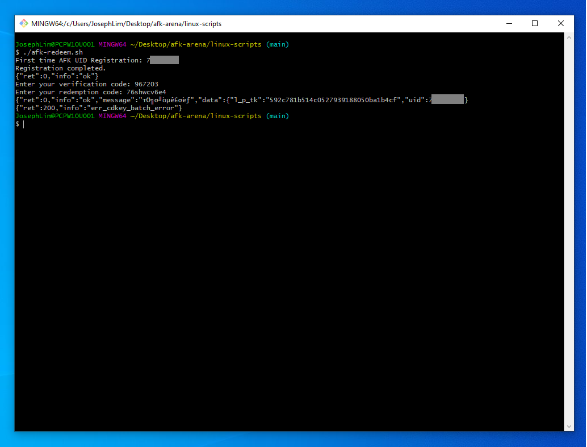

# afk-arena

## Download the bash script
https://raw.githubusercontent.com/josephlim75/afk-arena/main/linux-scripts/afk-redeem.sh

`IMPORTANT`: For Windows users, you need to run this in a linux emulator like cygwin, mingw or git bash command prompt.



## First time execution
It will ask for your AFK UID.  AFK UID can be found at


```
$ ./afk-redeem.sh
First time AFK UID Registration: 7xxxxx
Registration completed.
{"ret":0,"info":"ok"}
Enter your verification code: 586843
Enter your redemption code: 76shwcv6e4
{"ret":0,"info":"ok","message":"登录成功","data":{"l_p_tk":"a633218b48553a5d677019b1721dd6f9","uid":7xxxx}}
{"ret":200,"info":"err_cdkey_batch_error"}%                                                                   
```

## Subsequent execution
```
$ ./afk-redeem.sh
{"ret":0,"info":"ok"}
Enter your verification code: 586843
Enter your redemption code: 76shwcv6e4
{"ret":0,"info":"ok","message":"登录成功","data":{"l_p_tk":"a633218b48553a5d677019b1721dd6f9","uid":7xxxx}}
{"ret":200,"info":"err_cdkey_batch_error"}%                                                                   
```

## Support multiple code redemption
```
$ ./afk-redeem.sh
{"ret":0,"info":"ok"}
Enter your verification code: 694896
Enter your redemption code: 8e27shfk6b,85de5ae9ts,7k8n2s9bnx,6u226crhtp,happy2021
{"ret":0,"info":"ok","message":"登录成功","data":{"l_p_tk":"6be47691136dbe48884067774a549b9b","uid":7xxxx}}
{"ret":200,"info":"err_cdkey_batch_error"}
{"ret":200,"info":"err_cdkey_record_not_found"}
{"ret":200,"info":"err_cdkey_expired"}
{"ret":200,"info":"err_cdkey_expired"}
{"ret":200,"info":"err_cdkey_batch_error"}
```
